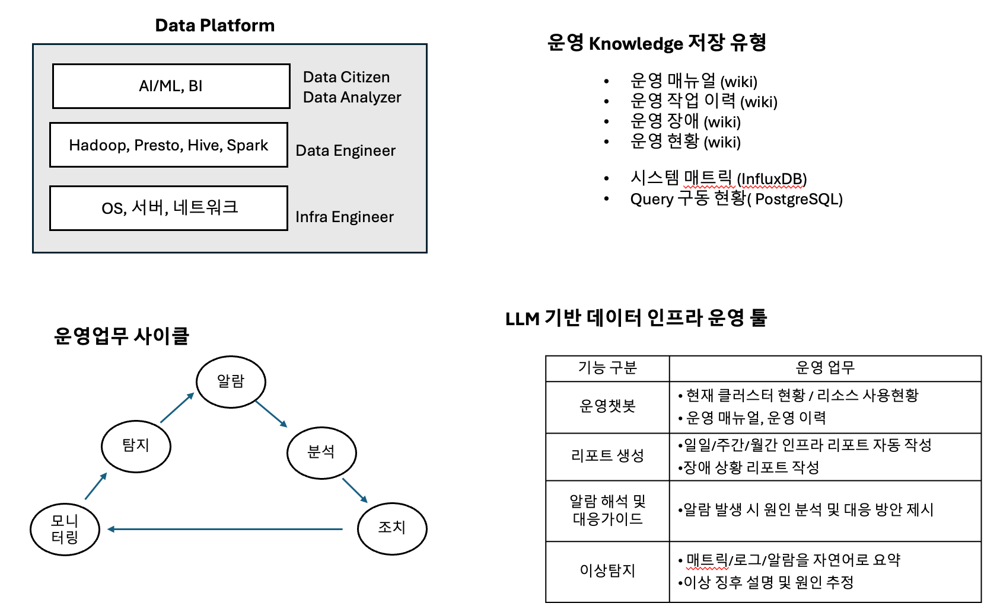

# LLM 기반 데이터 인프라 모니터링 서비스

LLM 기반 데이터 인프라 모니터링 서비스입니다.

Data Plaform 개요 



## 🎯 프로젝트 개요

클러스터 CPU 사용율이 높다는 알람을 받은 후 챗봇을 통해 인프라 상황을 분석하고 조치할 수 있는 서비스입니다.

### 주요 기능

- **Infra Engineer Agent**: 클러스터 가동율 및 시스템 현황 분석
- **Data Engineer Agent**: Spark 잡 관리 및 최적화
- **Admin Guide Agent**: 운영 매뉴얼, 이력, 외부 정보 검색
- **Gradio 웹 인터페이스**: 사용자 친화적인 챗봇 인터페이스

## 🏗️ 시스템 아키텍처

```
사용자 질문 → 라우팅 분석 → 적절한 에이전트 선택 → 처리 → 최종 답변
    ↓
인프라 관련 → Infra Engineer Agent
데이터 관련 → Data Engineer Agent  
운영 관련 → Admin Guide Agent
    ↓
각 에이전트 → Generate Final Answer → 최종 답변
```

## 📋 시나리오

### 라우팅 예시:

1. **"현재 클러스터 가동율 알려줘?"** → **Infra Engineer Agent**
   - 키워드: "클러스터", "가동율" → 인프라 관련으로 분류
   - 클러스터 시스템 리소스 사용현황 매트릭 분석

2. **"리소스를 많이 사용하는 spark 잡 3개 추출해줘?"** → **Data Engineer Agent**
   - 키워드: "spark", "잡" → 데이터 관련으로 분류
   - Spark 잡 정보 조회 및 분석

3. **"클러스터 가동율이 높을때 어떻게 해야되?"** → **Admin Guide Agent**
   - 키워드: "어떻게", "해야되" → 운영 관련으로 분류
   - 운영 매뉴얼, 이력, 인터넷 정보 종합

4. **"이 중에서 상위 2개 spark 잡 Kill 해줘?"** → **Data Engineer Agent**
   - 키워드: "spark", "잡", "kill" → 데이터 관련으로 분류
   - Spark 잡 종료 기능 실행

5. **"클러스터 사용율이 떨어졌는지 확인해줘?"** → **Infra Engineer Agent**
   - 키워드: "클러스터", "사용율", "확인" → 인프라 관련으로 분류
   - 조치 후 상태 재확인


## 🔧 주요 컴포넌트

### 0. RAG (Retrieval-Augmented Generation) 시스템

운영 매뉴얼과 운영 이력을 Chroma 벡터 데이터베이스로 구축하고 OpenAI Embeddings를 사용한 유사도 검색을 구현했습니다.

#### RAG 시스템 구성 요소:
- **문서 로더**: `TextLoader`를 사용하여 텍스트 파일 로드
- **텍스트 분할**: `RecursiveCharacterTextSplitter`로 청크 단위 분할
- **임베딩**: OpenAI `text-embedding-3-small` 모델 사용
- **벡터 데이터베이스**: Chroma DB로 벡터 저장 및 검색
- **유사도 검색**: 쿼리와 가장 유사한 문서 3개 검색

#### 벡터 데이터베이스 구조:
```
chroma_db/
├── operation_manual/     # 운영 매뉴얼 벡터 저장소
└── operation_history/    # 운영 이력 벡터 저장소
```

#### 검색 프로세스:
1. **운영 매뉴얼/이력 검색**: 사용자 질문 → OpenAI Embeddings로 벡터화 → Chroma DB에서 유사한 문서 검색 (k=3)
2. **인터넷 검색**: 사용자 질문 → Tavily API로 실시간 웹 검색 → 관련 도메인에서 최신 정보 수집
3. **통합 답변**: 검색된 모든 정보를 LLM에 전달하여 종합적인 답변 생성

#### Tavily 검색 특징:
- **신뢰할 수 있는 도메인**: Apache, Databricks, Cloudera, Stack Overflow, Medium 등
- **고급 검색**: Advanced 검색 모드로 정확한 결과 제공
- **최대 5개 결과**: 관련성 높은 상위 5개 검색 결과 반환
- **오류 처리**: API 키 없음, 검색 실패, 네트워크 오류 시 명확한 오류 메시지 제공

### 1. 도구 (Tools)

- `get_cluster_metrics()`: 클러스터 시스템 리소스 사용량 조회
- `get_spark_jobs()`: Spark 잡 정보 조회
- `kill_spark_job()`: Spark 잡 종료
- `search_operation_manual()`: 운영 매뉴얼 벡터 검색 (Chroma DB)
- `search_operation_history()`: 운영 이력 벡터 검색 (Chroma DB)
- `search_internet_info()`: Tavily를 사용한 인터넷 정보 검색

### 2. 에이전트 (Agents)

- **Infra Engineer Agent**: 클러스터 상태 분석
- **Data Engineer Agent**: Spark 잡 관리
- **Admin Guide Agent**: 운영 가이드 제공

### 3. LangGraph 워크플로우

```
START → Route Query → Conditional Routing → Selected Agent → Generate Answer → END
                                    ↓
                            ┌─────────┼─────────┐
                            │         │         │
                    Infra Engineer  Data Engineer  Admin Guide
                            │         │         │
                            └─────────┼─────────┘
                                    ↓
                            Generate Answer
```

#### 라우팅 로직:
- **인프라 관련**: 클러스터, CPU, 메모리, 디스크, 네트워크, 리소스, 가동율 등
- **데이터 관련**: Spark, Hadoop, HDFS, YARN, Presto, 잡, 파이프라인 등  
- **운영 관련**: 매뉴얼, 운영, 절차, 가이드, 이력, 경험, 사례 등

## 💡 사용 예시

### 예시 질문들

1. **현재 클러스터 가동율 알려줘?**
   - 클러스터의 CPU, 메모리, 디스크, 네트워크 사용률 분석

2. **클러스터 가동율이 높을때 어떻게 해야되?**
   - 운영 매뉴얼, 이전 사례, Tavily 검색을 통한 최신 정보를 종합한 조치 방안 제시

3. **리소스를 많이 사용하는 spark 잡 3개 추출해줘?**
   - CPU 사용률 기준 상위 3개 Spark 잡 정보 제공

4. **이 중에서 상위 2개 spark 잡 Kill 해줘?**
   - 리소스 사용량이 높은 상위 2개 잡 종료

5. **클러스터 사용율이 떨어졌는지 확인해줘?**
   - 조치 후 클러스터 상태 재확인

## 🛠️ 기술 스택

- **LangChain**: LLM 애플리케이션 프레임워크
- **LangGraph**: 워크플로우 및 에이전트 관리
- **OpenAI GPT-4**: LLM 모델
- **OpenAI Embeddings**: 텍스트 임베딩
- **Chroma**: 벡터 데이터베이스 (RAG 시스템)
- **Tavily**: 인터넷 검색 API
- **Gradio**: 웹 인터페이스

#

